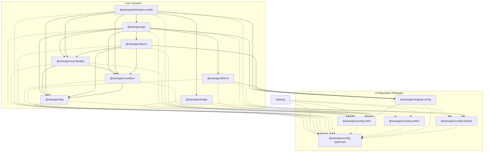

# @swissgeo Packages Dependency Map

State made on the 2026-01-21 (subject to change)

This document maps the dependencies between the packages exported to NPMJS.com under the `@swissgeo` organization.

## Dependency Graph

## Dependency Table

| Package | Dependencies (@swissgeo) | DevDependencies (@swissgeo) |
| ------- | ------------------------ | --------------------------- |
| `@swissgeo/api` | `coordinates`, `layers`, `log`, `numbers`, `staging-config`, `theme` | `config-eslint`, `config-prettier`, `config-typescript` |
| `@swissgeo/coordinates` | `log`, `numbers` | `config-eslint`, `config-typescript` |
| `@swissgeo/elevation-profile` | `api`, `coordinates`, `log`, `numbers`, `staging-config`, `tooltip` | `config-eslint`, `config-stylelint`, `config-typescript` |
| `@swissgeo/layers` | `coordinates`, `log`, `numbers`, `staging-config` | `config-eslint`, `config-typescript` |
| `@swissgeo/log` | - | `config-eslint`, `config-typescript` |
| `@swissgeo/numbers` | `log` | `config-eslint`, `config-typescript` |
| `@swissgeo/theme` | `staging-config` | `config-eslint`, `config-stylelint`, `config-typescript` |
| `@swissgeo/tooltip` | - | `config-eslint`, `config-stylelint`, `config-typescript` |
| `@swissgeo/config-eslint` | - | `config-typescript` |
| `@swissgeo/config-prettier` | - | `config-typescript` |
| `@swissgeo/config-stylelint` | - | `config-typescript` |
| `@swissgeo/config-typescript` | - | - |
| `@swissgeo/staging-config` | - | `config-eslint`, `config-typescript` |

## Dependency Matrix

This table shows which package imports which dependency.
- **X**: Production dependency
- **d**: Development dependency

| Importing Package | api | coord | draw | elev | layr | log | numb | thme | tool | esl | pret | styl | ts | stag |
| :--- | :---: | :---: | :---: | :---: | :---: | :---: | :---: | :---: | :---: | :---: | :---: | :---: | :---: | :---: |
| `@swissgeo/api` | - | X | | | X | X | X | X | | d | | | d | X |
| `@swissgeo/coordinates` | | - | | | | X | X | | | d | | | d | |
| `@swissgeo/elevation-profile` | X | X | | - | | X | X | | X | d | | d | d | X |
| `@swissgeo/layers` | | X | | | - | X | X | | | d | | | d | X |
| `@swissgeo/log` | | | | | | - | | | | d | | | d | |
| `@swissgeo/numbers` | | | | | | X | - | | | d | | | d | |
| `@swissgeo/theme` | | | | | | | | - | | d | | d | d | X |
| `@swissgeo/tooltip` | | | | | | | | | - | d | | d | d | |
| `@swissgeo/config-eslint` | | | | | | | | | | - | | | d | |
| `@swissgeo/config-prettier` | | | | | | | | | | | - | | d | |
| `@swissgeo/config-stylelint` | | | | | | | | | | | | - | d | |
| `@swissgeo/config-typescript` | | | | | | | | | | | | | - | |
| `@swissgeo/staging-config` | | | | | | | | | | d | | | d | - |

**Legend:**
- **api**: `@swissgeo/api`
- **coord**: `@swissgeo/coordinates`
- **elev**: `@swissgeo/elevation-profile`
- **layr**: `@swissgeo/layers`
- **log**: `@swissgeo/log`
- **numb**: `@swissgeo/numbers`
- **thme**: `@swissgeo/theme`
- **tool**: `@swissgeo/tooltip`
- **esl**: `@swissgeo/config-eslint`
- **pret**: `@swissgeo/config-prettier`
- **styl**: `@swissgeo/config-stylelint`
- **ts**: `@swissgeo/config-typescript`
- **stag**: `@swissgeo/staging-config`
